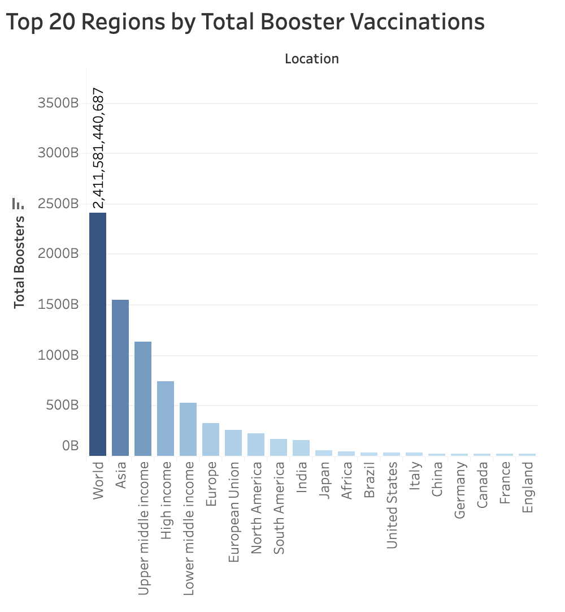

# Global Vaccination Data Analysis & Insights

## Introduction

The COVID-19 pandemic posed an unprecedented challenge, driving the global development and distribution of vaccines at a record pace. However, vaccine rollout has varied widely across regions, and the need for booster doses has created further disparities. This analysis explores global vaccination progress, highlights gaps in vaccination rates, and provides insights into booster dose distribution.

---

## Table of Contents
1. [Global Vaccination Progress (2020-2024)](#global-vaccination-progress-2020-2024)
2. [Top 20 Regions by Booster Vaccinations](#top-20-regions-by-booster-vaccinations)
3. [Vaccination Rates Per 100 People](#vaccination-rates-per-100-people)
4. [World Map of Vaccination Rates](#world-map-of-vaccination-rates)
5. [Conclusion](#conclusion)

---

## Global Vaccination Progress (2020-2024)

This graph illustrates global vaccination progress from 2020 to 2024. The sharp increase between 2020 and 2023 shows the rapid rollout of vaccines, with a notable decline in 2024.

### Key Insight:
- The initial mass vaccination effort was effective, but the decline in 2024 suggests a decrease in demand or logistical challenges for subsequent doses and boosters.

---

## Top 20 Regions by Booster Vaccinations

This chart displays the top 20 regions by total booster vaccinations. Wealthier regions lead the booster rollout, with significant variations even among high-income countries.

### Key Insight:
- Booster doses have been prioritized in wealthier regions, but there are still large gaps in some regions that require attention.

---

## Vaccination Rates Per 100 People

This bar chart compares vaccination rates per 100 people across different regions. The data highlights regional disparities, with countries like Canada and Cuba leading in terms of coverage.

### Key Insight:
- High-income countries are leading the race in vaccination coverage, but efforts must continue to bridge the gap with lower-income regions.

---

## World Map of Vaccination Rates

The world map visualizes the distribution of vaccinations per 100 people across countries. Darker regions represent higher vaccination rates, while lighter regions show lower coverage.

### Key Insight:
- Global disparities in vaccination rates remain significant, particularly in developing regions, which underscores the need for continued global cooperation.

---

## Conclusion

While substantial progress has been made in vaccinating large parts of the global population, the data highlights stark disparities in both primary vaccination and booster coverage. Policy makers and global health organizations must focus on continuing the vaccination campaigns, especially in underserved regions, to mitigate the risk of future outbreaks.
